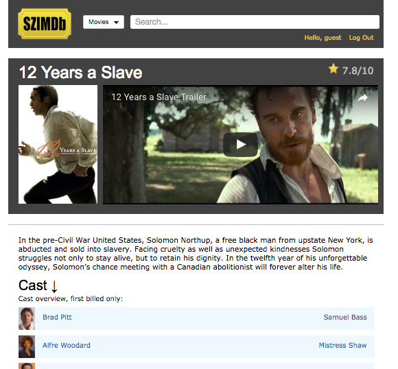
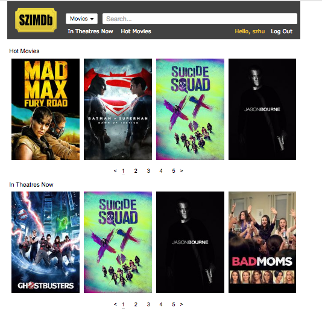

# SZIMDb

[SZIMDb][heroku]

[heroku]: http://www.szimdb.herokuapp.com

SZIMDb is a full-stack web application inspired by IMDb.  It utilizes Ruby on Rails on the backend, a PostgreSQL database, and React.js with a Flux architectural framework on the frontend.  

## Features & Implementation

##Search functionality for Movies and Actors

Users can search for a particular profile for any Movie or Actor.  The profile data is drawn from the following API: theMovieDB.  

##Movie Profiles:

Movie profiles contain information about the movie, as well as its casting information.  The casting is sorted by number of credits.

##Actor Profiles:

Actor profiles contain information about the actor, as well as the movies they have starred in.  Their starred movies is sorted by date.

Users of the website can link between any movie and actor profile, drawing clear connections between two entities.  

##Movie displays

Users can view a carousel display of now playing movies and popular movies.  The ratings are also drawn from theMovieDB.

##User Functionality:

Currently, logged in users can only post comments pertaining to a profile.  I plan to add the following functionality soon:
  - [ ] delete comments
  - [ ] edit comments
  - [ ] load user photo
